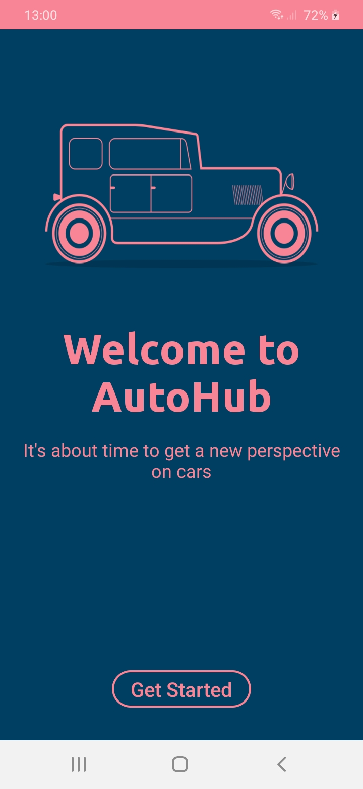
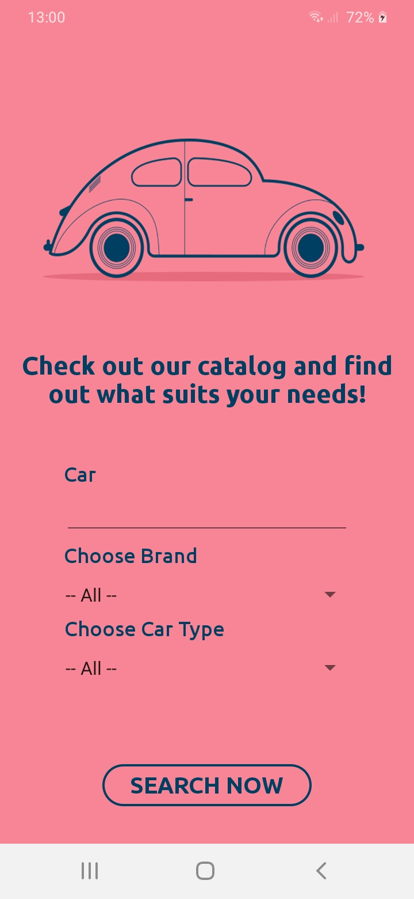
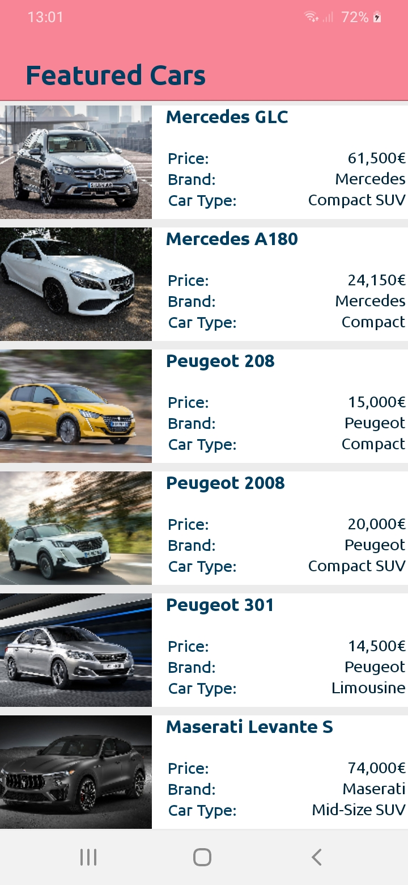

# AutoHub
A native Android mobile app written in Android Studio using Java for retrieving a list of modern car models based on their manufacturer and type. This project was developed for the course Software Development for Mobile Devices of the Msc program in the Applied Informatics department of the International Hellenic University.

## Features
* Present a list of all car models available in the backend database
* Search for specific car models, car brands or car types
* Show details of each specific car model 
* Link to retrieve more info from the internet
* Compatible with the latest Android 11 OS
* Small size (less than 2MB!)
* Unique color theme

## Screenshots

  
  
  
  

## Author
[Evdoxia Deligianni](https://github.com/evideli)

## Version
1.0
